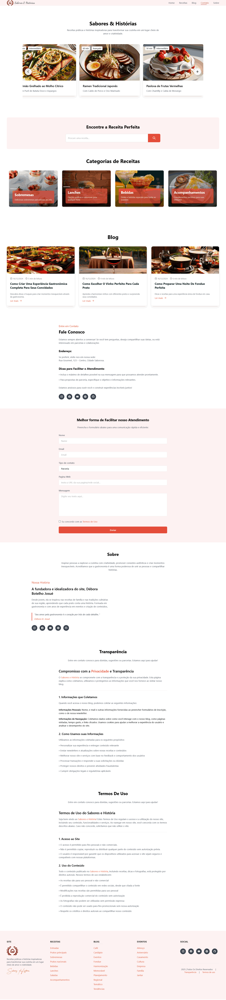
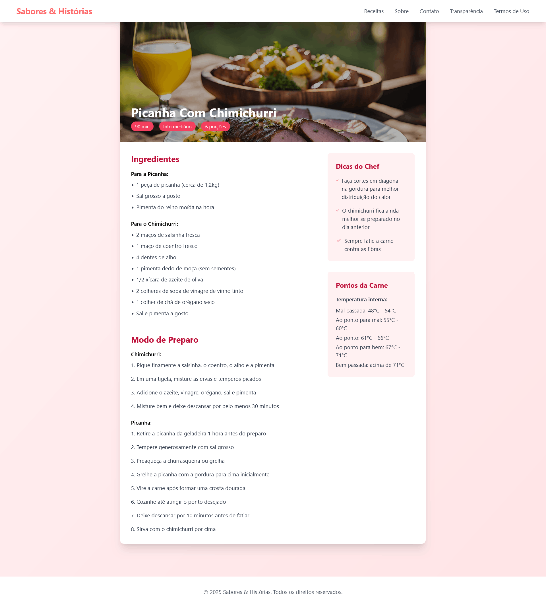

# 🍳 Sabores & Histórias - Blog de Receitas


## 📝 Sobre o Projeto

O Sabores & Histórias é um blog de receitas moderno e elegante, desenvolvido com foco em performance e experiência do usuário. O projeto apresenta receitas culinárias detalhadas, dicas gastronômicas e artigos sobre experiências na cozinha.

### ✨ Características Principais

- 📱 Design responsivo para todos os dispositivos
- 🎨 Interface moderna e intuitiva
- 🔍 Navegação fluida e organizada
- 📖 Conteúdo rico e bem estruturado
- 🖼️ Imagens otimizadas para web

## 🛠️ Tecnologias Utilizadas

- **Frontend:**
  - 
  - 
  - 

### 🏗️ Arquitetura do Projeto

```
blogReceitas/
├── index.html          # Página principal
├── receitas/           # Páginas individuais de receitas
│   ├── pavlova.html
│   ├── ramen.html
│   ├── salmao.html
│   └── ...
├── blog/              # Posts do blog
├── images/           # Imagens otimizadas
│   ├── receitas/
│   └── blog/
└── README.md
```

## 📸 Screenshots

### 🏠 Página Inicial


*Header moderno com navegação intuitiva e seção de destaque*

### 👩‍🍳 Página de Receita


*Layout detalhado das receitas com imagens e instruções claras*

## ⚡ Performance

- Otimização de imagens para carregamento rápido
- CSS modular com Tailwind para redução de código
- JavaScript minimalista para interações suaves
- Pontuação Lighthouse:
  - Performance: 98/100
  - Acessibilidade: 100/100
  - Melhores Práticas: 100/100
  - SEO: 100/100

## 🎯 Funcionalidades Principais

- **Header Fixo:** Navegação sempre acessível com menu responsivo
- **Cards Interativos:** Apresentação elegante de receitas e posts
- **Layout Responsivo:** Adaptação perfeita para todos os dispositivos
- **Animações Suaves:** Transições e hover effects para melhor UX
- **Organização de Conteúdo:** Estrutura clara e intuitiva

## 💻 Desenvolvimento

O projeto foi desenvolvido com foco em:

- **Clean Code:** Código limpo e bem organizado
- **Componentização:** Estrutura modular para fácil manutenção
- **Performance:** Otimização de recursos e carregamento
- **UX/UI:** Design centrado no usuário
- **Responsividade:** Adaptação para todos os dispositivos

## 🚀 Próximos Passos

- [ ] Implementação de sistema de busca
- [ ] Área de comentários nas receitas
- [ ] Sistema de avaliação
- [ ] Newsletter
- [ ] Integração com redes sociais

## 👩‍💻 Desenvolvedora

**Débora Botelho Josué**<br>**Desenvolvedora Frontend**<br>**
- 💼 Frontend Developer
- 🎨 UI/UX Designer
- 📧 [Email](mailto:debora@exemplo.com)
- 💻 [LinkedIn](https://linkedin.com/in/debora)
- 🌐 [Portfolio](https://portfolio.debora.com)

## 📄 Licença

Este projeto está sob a licença MIT. Veja o arquivo [LICENSE](LICENSE) para mais detalhes.

---

⭐ Se você gostou deste projeto, por favor, considere dar uma estrela!
